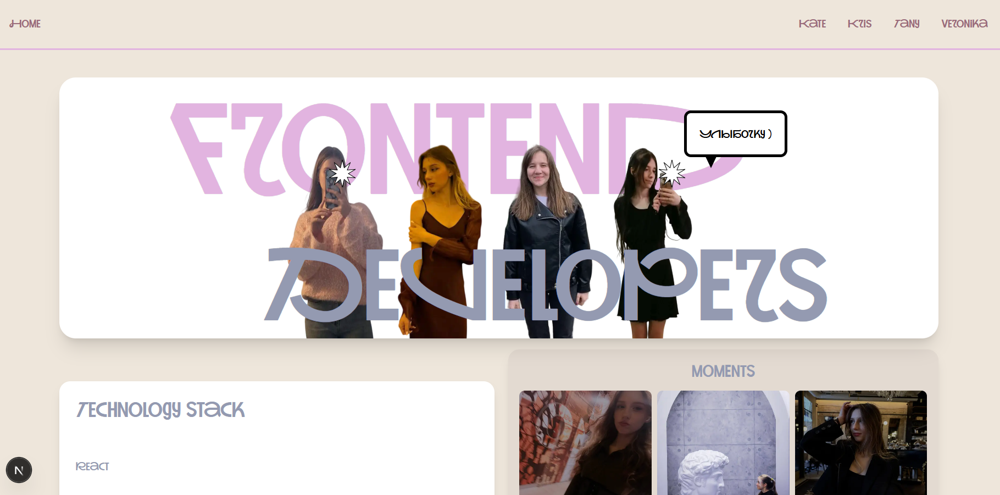

# DevOps Portfolio Website (Next.js)

Веб-приложение для представления портфолио участников команды.
Проект разработан на 3 курсе колледжа в рамках дисциплины DevOps.

## О проекте

Проект представляет собой многостраничный сайт с портфолио участников команды, где каждый разработчик презентует свои навыки и сильные стороны.

Основной акцент сделан не только на разработке интерфейса, но и на организации командной работы, Git workflow и процессах DevOps.

## Демо 



## Задача проекта
 - разработать сайт с портфолио участников команды
 - организовать командную разработку через Git
 - реализовать структуру веток и workflow
 - освоить работу с Next.js
 - применить компонентный подход
 - реализовать стилизацию и анимации интерфейса

## Функционал
 - страницы портфолио участников
 - кастомный дизайн и анимации
 - интерактивные элементы (popup, эффекты)

## Технологии
 - Next.js
 - React
 - Tailwind CSS
 - JavaScript
 - Git / GitHub

## Роль в проекте

**Выполненные задачи:**

 - разработка главной страницы
 - участие в командной разработке и ее организация
 - работа с Git (ветки, merge, pull request)
 - настройка правил репозитория и правил работы с ним
 - взаимодействие с архитектурой проекта
 - участие в обсуждении структуры и реализации
   
№№ Git Workflow

**В проекте использовалась модель командной разработки с разделением веток:**
```
master — основная (production) ветка
develop — ветка разработки (integration branch)
feature/* — ветки отдельных разработчиков
```
### Принципы работы
**тимлид отвечает за:**
 - архитектуру проекта
 - документацию
 - проверку и принятие Pull Request
**разработчики:**
 - работают в отдельных feature-ветках
 - создают Pull Request в develop
 - после проверки изменения попадают в master

## Ветки проекта
**Основные ветки**
```
master — стабильная версия проекта
develop — ветка разработки
```
**Feature-ветки**
```
feature/portfolio-kris
feature/KateNew
feature/tatiana
feature/nickname-page
```

## Что решает проект

**Проект направлен на:**

 - освоение командной разработки
 - понимание Git workflow
 - работу с ветвлением и pull request
 - организацию совместной разработки

## Практикуемые навыки

 - работа с Git (branching, merge, PR)
 - командная разработка
 - использование Next.js
 - компонентный подход (React)
 - работа с UI и анимациями

## Структура проекта
```
DevOpsProject/
├── public/                 # статические файлы
├── src/
│   ├── app/
│   │   ├── components/     # компоненты (PopUp, Star и др.)
│   │   ├── portfolio/      # страницы участников
│   │   ├── styles/
│   │   ├── layout.js
│   │   └── page.jsx
│
├── preview/                # скриншоты проекта
├── package.json
└── next.config.mjs
```

## Запуск проекта
```
cd DevOpsProject 
npm install
npm run dev
```

**После запуска:**
http://localhost:3000

## Итог

Проект стал практикой реальной командной разработки с использованием Git и современного frontend-стека.

**В ходе работы были освоены:**

 - организация Git workflow
 - работа с ветками и Pull Request
 - взаимодействие в команде разработчиков
 - разработка на Next.js
 - построение компонентной архитектуры

